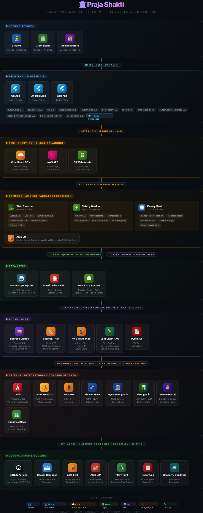

<div align="center">

# 🌾 PrajaShakti AI

### *जहाँ किसान की आवाज़ बदलाव बनती है*
### *Where a farmer's voice becomes change*

**The only platform where a voice note becomes a satellite-confirmed, scheme-matched, trackable development project.**

<br/>

[](https://djangoproject.com)
[](https://flutter.dev)
[](https://aws.amazon.com/bedrock)
[](https://postgresql.org)
[](https://docs.celeryq.dev)
[](https://twilio.com)

<br/>

> 🏆 **Rural Innovation Hackathon 2026** — AI-powered community intelligence for India's 2.5 lakh+ Panchayats

</div>

---

## 🎯 The Problem

India's 640,000 villages face a **broken feedback loop**:

| Pain Point | Reality |
|---|---|
| 🗣️ Citizens have needs | But no structured way to report them |
| 📋 Leaders have budgets | But no data to prioritise spending |
| 🏛️ Government has schemes | But 60%+ subsidy money goes unused |
| 📡 Satellites see crop stress | But data never reaches the village |

A water crisis in Ward 3 stays invisible while ₹12 lakh of Panchayat funds sit unused. **PrajaShakti AI fixes this.**

---

## 💡 The Solution

```
Citizen speaks → AI listens → Satellite confirms → Scheme matched → Project adopted → Problem solved
```

Three pillars working together:

| Pillar | What it does |
|---|---|
| 🎙️ **Community Voice** | Citizens report needs via voice/WhatsApp in Hindi — no app, no literacy required |
| 🛰️ **Geo Intelligence** | Bhuvan ISRO NDVI satellite data + CGWB groundwater validates every report |
| 🤖 **Smart Action** | AI recommends projects, matches government schemes, auto-generates PDF proposals |

---

## ✨ Key Features

### 🗺️ Village Intelligence Map (7 Layers)
Real-time map with toggleable layers — report heatmaps, satellite NDVI overlays, infrastructure gaps, active projects, fund status, demographics, and project markers — all in one view. Each layer fetched from `/map/layers/` and rendered independently.

### 📱 WhatsApp Bot (Zero App Required)
Citizens send voice notes in Hindi → AWS Transcribe converts to text → Claude Sonnet categorises → geo-tagged report appears on the map instantly. No smartphone or literacy required.

```
Commands:
  GAON Tusra        → Select your village (required on first message)
  WARD 3            → Set your ward number
  [Voice Note]      → Report a need (AI transcribes + categorises)
  Status            → Check your latest report status
  Vote 1            → Upvote report #1
  PM-KUSUM          → Check scheme eligibility via RAG
  Help              → Show all commands in Hindi
```

New users are prompted to set their village with `GAON <name>` before any report is accepted. The command matches partial names and lists options if multiple villages match.

### 🧠 AI Priority Engine
Composite scoring algorithm weighing community signals (votes, geographic spread, Gram Sabha mentions), satellite data, and urgency modifiers to rank clusters **0–100**.

```
Priority Score = Community (40%) + Data Validation (40%) + Urgency (20%)
```

Each sub-score is fully transparent — the API returns a breakdown of all contributing signals.

### 📚 Scheme RAG Chatbot
pgvector-powered retrieval over 12 government schemes (PM-KUSUM, MGNREGA, JJM, PMGSY…). Ask in plain Hindi → get eligibility, application steps, and a fund convergence plan. Falls back to keyword search if embeddings are unavailable.

### 🏛️ Digital Gram Sabha
Leaders run AI-moderated village meetings. Citizens raise issues, vote on priorities, and at session end Claude Sonnet auto-generates a bilingual (Hindi + English) official summary saved to `session.transcript`.

### 📄 One-Click Proposal Generation

Leaders tap **Adopt** on any priority cluster → the system:

1. Creates a project record with status `in_progress`
2. Calculates a **Fund Convergence Plan** based on the project category:

   | Category | Scheme Mix |
   |---|---|
   | Water | PM-KUSUM 60% + MGNREGA 20% + Jal Jeevan Mission 10% = **90% covered** |
   | Road | PMGSY 60% + MGNREGA 30% = **90% covered** |
   | Sanitation | SBM-G 90% = **90% covered** |
   | Education | Samagra Shiksha 60% + MGNREGA 20% = **80% covered** |
   | Electricity | PM-KUSUM 60% + MGNREGA 20% = **80% covered** |

3. Generates a **PDF project proposal** (via ReportLab) with project details, location, fund table, scheme applications, and projected impact — uploaded to S3 with a 1-hour presigned download URL
4. Shows the full fund breakdown and **Download PDF** button inside the app — no blank screens, no broken dialogs

### 👥 Role-Based Access
Three roles with automatic post-login routing:
- **Citizen** → Community Feed
- **Leader** → Leader Dashboard (with Adopt, Fund Status, Active Projects)
- **Admin** → Government Dashboard + User Management

### 🌍 12 Languages
UI localised in English, Hindi, Bengali, Gujarati, Kannada, Malayalam, Marathi, Odia, Punjabi, Tamil, Telugu, and Urdu (ARB files + generated Dart delegates).

---

## 🏗️ Architecture



```
┌─────────────────────────────────────────────────────────────────┐
│                         Citizens                                 │
│              WhatsApp Bot          Flutter App (Web/Mobile)      │
└──────────┬──────────────────────────────────┬───────────────────┘
           │ Twilio Webhook                   │ REST API (JWT)
           ▼                                  ▼
┌─────────────────────────────────────────────────────────────────┐
│                    Django 5.x REST API                          │
│  auth_service │ community │ geo_intelligence │ ai_engine        │
│  scheme_rag   │ projects  │ notifications    │ data_ingestion   │
└──────┬────────────────────────────────────────────┬────────────┘
       │ Celery Tasks                               │ PostGIS queries
       ▼                                            ▼
┌──────────────┐   ┌──────────────┐   ┌───────────────────────────┐
│  AWS Bedrock │   │AWS Transcribe│   │  PostgreSQL 16            │
│Claude Sonnet │   │  Hindi Voice │   │  + PostGIS + pgvector     │
│Titan Embed   │   │  → Text      │   │  HNSW similarity index    │
└──────────────┘   └──────────────┘   └───────────────────────────┘
       │                                            │
       ▼                                            ▼
┌──────────────┐   ┌──────────────┐   ┌───────────────────────────┐
│    AWS S3    │   │  Redis 7     │   │   Bhuvan ISRO WMS         │
│  5 buckets   │   │  Broker +    │   │   NDVI Satellite Tiles    │
│  audio/docs  │   │  Cache       │   │   CGWB Groundwater        │
└──────────────┘   └──────────────┘   └───────────────────────────┘
```

---

## 🛠️ Tech Stack

| Layer | Technology |
|---|---|
| **Backend** | Django 5.x + Django REST Framework |
| **Async Tasks** | Celery 5.x + Redis 7 (thread fallback if broker down) |
| **Database** | PostgreSQL 16 + PostGIS + pgvector |
| **AI / LLM** | AWS Bedrock — Claude Sonnet 4.6 (inference profile) |
| **Voice** | AWS Transcribe (Hindi `hi-IN`) |
| **Embeddings** | Amazon Titan Embed Text v2 (1024-dim) |
| **Storage** | AWS S3 (5 buckets) |
| **PDF Generation** | ReportLab (server-side, no external dependencies) |
| **Frontend** | Flutter 3.x — Web + iOS + Android |
| **State Mgmt** | flutter_bloc (Cubit pattern) |
| **Navigation** | GoRouter (ShellRoute + responsive shell) |
| **Maps** | flutter_map + Bhuvan ISRO WMS proxy |
| **Bot** | Twilio WhatsApp Sandbox |
| **Notifications** | Firebase Cloud Messaging + AWS SNS |

---

## 🚀 Quick Start

### Prerequisites

| Tool | Version |
|---|---|
| Python | 3.13+ |
| PostgreSQL | 16 + PostGIS + pgvector |
| Redis | 7.x |
| Flutter | 3.x |
| AWS credentials | In `backend/.env` |

### 1. Start Backend

```bash
cd backend
source venv/bin/activate
python manage.py runserver
```

### 2. Load Demo Data (first time only)

```bash
python manage.py create_demo        # Tusra village, 65 reports, 2 clusters, 3 projects
python manage.py ingest_schemes     # Embed 12 schemes into pgvector (needs AWS)
python manage.py create_hnsw_index  # Create vector similarity index
```

### 3. Start Async Workers

```bash
# Terminal 2 — Celery worker (voice transcription, AI pipeline)
celery -A config worker -l info

# Terminal 3 — Celery beat (daily prices, weekly satellite refresh)
celery -A config beat -l info --scheduler django_celery_beat.schedulers:DatabaseScheduler
```

### 4. Start Flutter App

```bash
cd frontend
flutter pub get
flutter run -d chrome        # Web (leader dashboard — responsive)
flutter run                  # iOS / Android
```

### 5. WhatsApp Bot (local machine)

```bash
ngrok http 8000
# Set webhook in Twilio Console → https://xxxx.ngrok-free.app/api/v1/webhooks/whatsapp/
# Message +1 415 523 8886 on WhatsApp: "GAON Tusra"
```

### 6. WhatsApp Bot (production)

The WhatsApp bot is live in production via Twilio Sandbox. To try it:

1. Save **+1 415 523 8886** in your contacts
2. Send **`join fifth-depth`** on WhatsApp to this number to join the sandbox
3. Send **`GAON Tusra`** to select your village
4. Send a **voice note in Hindi** to report a need — AI will transcribe, categorise, and geo-tag it automatically

> 📖 See [RUNNING.md](RUNNING.md) for full setup, credentials, troubleshooting, and all API endpoints.

---

## 🗂️ Repository Structure

```
praja-shakti/
├── backend/                    Django 5.x API
│   ├── apps/
│   │   ├── auth_service/       JWT auth, OTP, role-based routing
│   │   ├── community/          Reports, votes, clusters, Gram Sabha
│   │   ├── geo_intelligence/   Satellite, maps, geospatial
│   │   ├── scheme_rag/         RAG pipeline, pgvector, fund convergence
│   │   ├── ai_engine/          Bedrock, Transcribe, scoring, recommendations
│   │   ├── projects/           Project lifecycle, PDF proposals, ratings
│   │   └── notifications/      WhatsApp bot, FCM, SMS
│   └── docker-compose.yml      PostgreSQL + Redis
│
├── frontend/                   Flutter 3.x app
│   └── lib/
│       ├── app/                Router (responsive shell), theme
│       ├── core/               API client, models, responsive utils
│       └── features/
│           ├── map/            Village Intelligence Map (7 layers)
│           ├── report/         Voice + text reporting
│           ├── community/      Feed, upvoting, clusters
│           ├── projects/       Tracker, timeline, ratings
│           ├── schemes/        RAG chatbot
│           ├── gram_sabha/     Digital village meetings + AI summary
│           └── dashboard/      Leader dashboard, adopt flow, proposal dialog
│
├── scripts/                    ETL, data ingestion, RAG indexing
├── data/                       DISHA Dashboard scraped data (8 villages)
└── RUNNING.md                  Complete running instructions
```

---

## 📊 Demo Data — Tusra Village, Balangir, Odisha

| Metric | Value |
|---|---|
| Village | Tusra, Balangir, Odisha |
| Population | 4,800 |
| Reports | 65 (water, road, health) |
| Clusters | 2 (water: priority 94/100, road: 45/100) |
| Projects | 3 (solar borewell in_progress, road repair in_progress, toilet block completed) |
| Schemes | 12 (PM-KUSUM, MGNREGA, JJM…) |
| NDVI Score | 0.12 (high stress zone) |
| Groundwater | 14.2m depth (CGWB) |
| Fund Available | ₹12L (eGramSwaraj) |
| Solar Borewell | ₹4.5L total — 90% scheme-funded (PM-KUSUM 60% + MGNREGA 20% + JJM 10%) |
| Panchayat Pays | ₹45,000 (10% of ₹4.5L) |

### Demo Users

| Role | Phone | OTP (dev) |
|---|---|---|
| Leader | `+919078277159` | See Django terminal or `otp_debug` field |
| Citizen | Any new number | Register via OTP flow |

---

## 🌐 Responsive Design

The Flutter web app is fully responsive and adaptive:

| Screen | Layout |
|---|---|
| **Mobile** (< 600px) | BottomNavigationBar + single-column cards |
| **Tablet** (600–1024px) | NavigationRail (icon-only) + 2-column grid |
| **Desktop** (> 1024px) | NavigationRail (extended labels) + multi-column layout + side detail panels |

Platform-adaptive icons: Cupertino on iOS, Material on Android/Web.

---

## 📡 Key API Endpoints

```
Base: http://127.0.0.1:8000/api/v1/

Auth
  POST  /auth/otp/send/           {"phone": "+91XXXXXXXXXX"} → otp_debug in dev
  POST  /auth/login/              {phone, otp} → JWT tokens + role
  GET   /auth/profile/

Community
  GET   /reports/?village=1
  POST  /reports/{id}/vote/
  GET   /reports/clusters/?village=1   Spatial clusters (GeoJSON)

AI & Intelligence
  GET   /ai/priorities/?village=1      Ranked clusters with score breakdown
  GET   /ai/recommendations/?village=1 AI project recommendations
  POST  /ai/scheme-query/              {query, village_id} → RAG answer + sources

Leader Actions
  GET   /dashboard/summary/?panchayat=1
  GET   /dashboard/fund-status/?panchayat=1
  POST  /projects/adopt/               {cluster_id, recommendation_index}
                                       → creates project, fund plan, PDF proposal
  GET   /projects/?village=1&status=in_progress
  GET   /projects/{id}/proposal/       Stream PDF (auth via Bearer or ?token=<jwt>)

Map
  GET   /map/layers/?village=1&layers=infra,heatmap,demographics,fund_status
  GET   /map/tiles/{z}/{x}/{y}.png     Bhuvan NDVI proxy (Redis-cached 7 days)

Gram Sabha
  POST  /gramsabha/               Create session
  POST  /gramsabha/{id}/end/      End session → triggers Claude AI summary

WhatsApp
  POST  /webhooks/whatsapp/       Twilio webhook (AllowAny — no JWT required)
```

---

## 🔒 Environment Variables

All credentials live in `backend/.env`:

```env
# Django
SECRET_KEY=...
DEBUG=True

# Database (use 127.0.0.1, not localhost — IPv6 issue on Apple Silicon)
DB_HOST=127.0.0.1
DB_NAME=prajashakti
DB_USER=your_user

# Redis
REDIS_URL=redis://127.0.0.1:6379/0

# AWS
AWS_ACCESS_KEY_ID=...
AWS_SECRET_ACCESS_KEY=...
AWS_REGION=us-east-1
BEDROCK_MODEL_ID=global.anthropic.claude-sonnet-4-6
BEDROCK_EMBEDDING_MODEL_ID=amazon.titan-embed-text-v2:0

# Twilio
TWILIO_ACCOUNT_SID=...
TWILIO_AUTH_TOKEN=...
TWILIO_WHATSAPP_NUMBER=whatsapp:+14155238886

# Bhuvan ISRO
BHUVAN_TOKEN=...
```

---

## 🌱 Impact at Scale

| Metric | Target |
|---|---|
| Panchayats | 2,50,000+ across India |
| Citizens reachable | 800 million (via WhatsApp — no smartphone required) |
| Schemes covered | 50+ central + state schemes |
| Languages | 12 implemented; extensible to all 22 scheduled languages |
| Fund efficiency | 40–60% improvement in scheme utilisation |

---

<div align="center">

**Built with ❤️ for Rural India**

*PrajaShakti AI — Rural Innovation Hackathon 2026*

</div>
